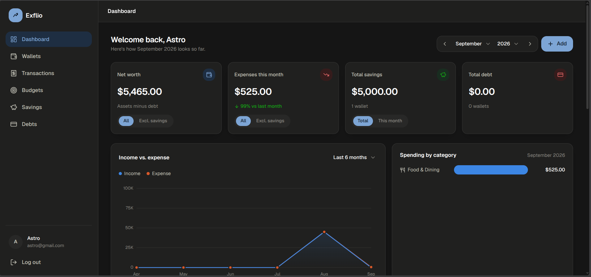
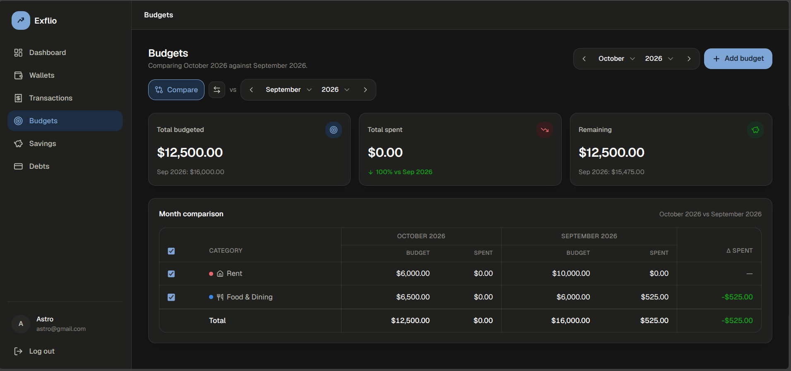
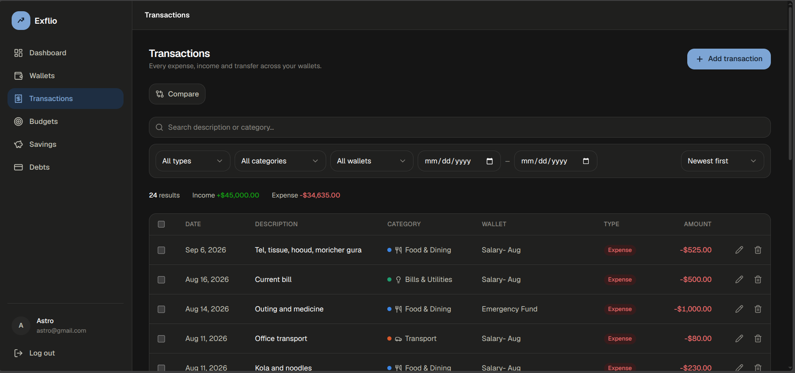
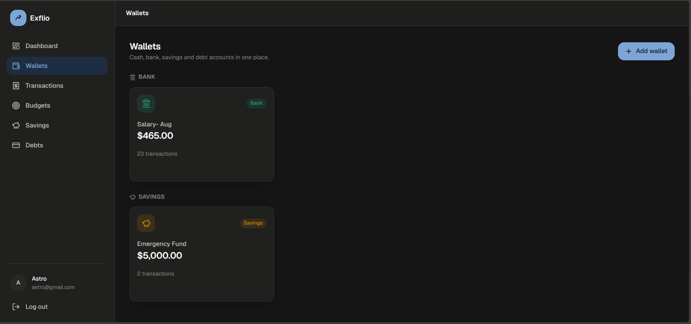
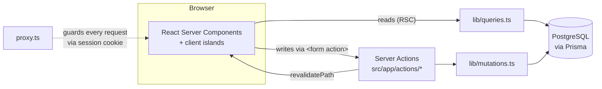

<div align="center">


# Exflio

**A full-stack personal finance tracker — cash, bank, savings and debt in one dashboard.**

Log expenses, income and transfers, budget by category, compare any two months side by side, and watch net worth move over time.

[](https://nextjs.org)
[](https://react.dev)
[](https://www.typescriptlang.org)
[](https://www.prisma.io)
[](https://neon.tech)
[](https://tailwindcss.com)

[Features](#features) · [Highlights](#engineering-highlights) · [Tech stack](#tech-stack) · [Getting started](#getting-started) · [Architecture](#how-it-works)

</div>

---

> **Note for reviewers:** the login page has a **"Try demo account"** button that fills in a read-only-in-spirit demo login — no sign-up required to look around.

## Screenshots

| Dashboard | Budgets (compare mode) |
|---|---|
|  |  |

| Transactions | Wallets |
|---|---|
|  |  |

## Features

### Accounts

- **Four wallet types** — Cash, Bank, Savings, Debt (credit cards / loans) — each with its own balance and currency.
- Create, rename, and delete wallets. Deleting a wallet **soft-deletes** it (history stays intact for old transactions) and only an empty wallet can be deleted.
- A debt wallet's balance means *amount owed*, not cash on hand — an expense on it increases what you owe (e.g. a card purchase), a transfer into it pays it down. The same two rules (`expense` subtracts, `income` adds, sign flipped for debt) drive every wallet, so "pay off a card" and "move money into savings" both just fall out of a transfer.

### Transactions

- Three kinds: **expense**, **income**, **transfer** (wallet-to-wallet).
- Fixed category lists per kind (Food & Dining, Transport, Salary, Investment, etc.) so a category always maps to the same color in charts.
- Full CRUD with a live-updating wallet balance on every create/edit/delete, run inside a DB transaction so the balance and the transaction row never drift apart.
- Server-side pagination, free-text search, filtering by type/category/wallet/date range, and sorting (newest/oldest, amount high→low/low→high) — all reflected in the URL (shareable, back-button-friendly), with a "Clear filters" reset.
- **Month-over-month comparison** — pick any two months and see a category-by-category expense breakdown with the delta between them, swap the two months with one click.
- On mobile, filters collapse behind a toggle (with an active-filter count badge) so the page isn't dominated by empty dropdowns.

### Budgets

- Set a monthly spending limit per category and track actual spend against it, with an over-budget state that reads clearly at a glance.
- The **same month-comparison engine** as Transactions — compare this month's budget performance against any other month, side by side, with one click to swap which month is "base."
- Budget-vs-actual also surfaces on the Dashboard for the current month, so you don't have to leave the overview to see whether you're on track.

### Dashboard

- Toggleable stat cards: **Net worth** (all wallets, or excluding savings), **Expenses this month** (all, or excluding money moved into savings), **Savings** (running total, or just this month's net contribution) — each with a vs.-last-month delta.
- **Selectable trend range** for the income-vs-expense chart: last week, this month, last month, or last 6 months.
- Spending-by-category breakdown for the selected month, hand-built as inline SVG (no charting library).
- A month/year picker for browsing any period, a wallet preview (max 4, "View all" for the rest), and the 6 most recent transactions.

### Savings & Debts

- Dedicated pages that filter the wallet/transaction data down to just that type, with the same stat-card + wallet-grid + history layout as the dashboard.

### Design

- Custom design system: navy accent, light/dark mode (via `prefers-color-scheme`, overridable per-user), a fixed categorical color palette for charts validated for colorblind-safe contrast.
- A hand-built, fully accessible `Dropdown` component (keyboard navigation, typeahead, `role="combobox"`/`listbox`) used everywhere instead of the native `<select>`, so it can be styled and positioned consistently — including correctly inside modals.
- Responsive throughout: a fixed sidebar with independently scrolling content, card grids that step from 4 → 2 → 1 columns as the screen narrows.

## Engineering highlights

A few things worth pointing out if you're skimming this as a portfolio piece rather than cloning it:

- **No client-side data-fetching library, and no third-party auth library.** Every page is a React Server Component reading straight from Prisma; every write is a Server Action called from `<form action={...}>`. Auth is `scrypt` password hashing + an HMAC-signed session cookie, both written from scratch against `node:crypto`.
- **Money math that can't drift.** Wallet balances are updated inside the same DB transaction as the transaction row that caused the change — a crash or concurrent edit can't leave a balance and its history out of sync. One signed-delta formula (`expense` subtracts, `income` adds, sign flipped for debt wallets) covers all four wallet types and all three transaction kinds, including "pay off a card" and "fund savings," which are both just transfers.
- **Comparison mode as a reusable pattern, not a one-off.** The same "pick a base month, pick a compare month, swap them" interaction and URL-param shape powers budget comparison *and* category-comparison on the Transactions page — one mental model, two features.
- **Zero charting-library dependency.** The trend chart and category breakdown are hand-built inline SVG, paired with a fixed categorical color palette assigned by category position (not generated), so a category is always the same color and the palette is checked for colorblind-safe contrast.
- **Filters live in the URL**, not component state — search, type, category, wallet, date range, sort, and comparison months are all query params, so every view is shareable and survives the back button.
- **Accessibility taken seriously for a solo project.** The custom `Dropdown` used everywhere implements real combobox/listbox ARIA semantics and keyboard/typeahead support instead of reaching for the native `<select>` and fighting its styling limits.

## Tech stack

| | |
|---|---|
| Framework | [Next.js](https://nextjs.org) 16 (App Router, Server Actions, Turbopack) |
| UI | React 19, TypeScript, Tailwind CSS v4 |
| Icons | [lucide-react](https://lucide.dev) |
| Database | PostgreSQL via [Prisma](https://www.prisma.io) ORM |
| Auth | Custom cookie session — HMAC-signed (`node:crypto`), password hashing via `scrypt` — no third-party auth library |

## Getting started

### Prerequisites

- Node.js 20+
- A PostgreSQL database. This project is built and tested against [Neon](https://neon.tech)'s serverless Postgres, but any Postgres instance works.

### 1. Clone and install

```bash
git clone https://github.com/Shazzadul-Shakib/exflio.git
cd exflio
npm install
```

`npm install` also runs `prisma generate` automatically (via `postinstall`), so the Prisma Client is ready right after.

### 2. Configure environment variables

Copy the example file and fill it in:

```bash
cp .env.example .env
```

| Variable | Required | Description |
|---|---|---|
| `DATABASE_URL` | Yes | Postgres connection string. If you're on Neon, use the **pooled** connection string (the one with `-pooler` in the hostname) — it's built for many short-lived serverless connections. |
| `SESSION_SECRET` | Yes | Signs session cookies. Generate one with `openssl rand -hex 32`. There's no fallback — the app won't sign a session without it. |

### 3. Set up the database

Push the Prisma schema to your database:

```bash
npm run db:push
```

(This project manages its schema with `prisma db push` rather than versioned migrations — there's no `prisma/migrations` folder. Use `npm run db:migrate` instead if you'd rather switch to a migration-based workflow.)

### 4. Run the dev server

```bash
npm run dev
```

Open [http://localhost:3000](http://localhost:3000) — you'll land on `/login`. Use "Create an account" to sign up (a new account starts with four default wallets: Cash, Main Bank, Savings, Credit Card), or click **"Try demo account"** to explore with existing data.

## Available scripts

| Script | What it does |
|---|---|
| `npm run dev` | Start the dev server (Turbopack) |
| `npm run build` | Production build |
| `npm run start` | Serve the production build |
| `npm run lint` | ESLint |
| `npm run db:generate` | Regenerate the Prisma Client |
| `npm run db:push` | Push `schema.prisma` to the database (no migration history) |
| `npm run db:migrate` | Create/apply a dev migration |
| `npm run db:deploy` | Apply pending migrations (production) |
| `npm run db:studio` | Open Prisma Studio (a GUI for your database) |

## Project structure

```
src/
  app/
    (auth)/              # /login, /signup — unauthenticated layout
    (app)/                # /dashboard, /wallets, /transactions, /budgets, /savings, /debts
    actions/              # Server Actions (auth.ts, wallets.ts, transactions.ts, budgets.ts) — all writes go through these
  components/
    ui.tsx                # Button, Input, Select, Field, Card, Badge, EmptyState — the shared component kit
    Dropdown.tsx           # Custom accessible dropdown (used as `Select` everywhere)
    dashboard/             # Stat cards (incl. toggleable), charts, month/trend-range pickers
    transactions/          # Transaction form, table, filters, month-comparison table
    budgets/               # Budget form/table, progress chart, month-comparison table + toggle
    wallets/               # Wallet cards, forms
    shell/                 # Sidebar / app shell
  lib/
    db.ts                  # Prisma client singleton + retry logic for transient connection errors
    session.ts             # Cookie session read/write, requireUser()/getCurrentUser()
    crypto.ts              # Password hashing (scrypt) + session token signing (HMAC)
    users.ts, queries.ts, mutations.ts   # Data access layer (incl. paginated transaction queries)
    finance.ts             # Wallet balance math, net worth, monthly aggregation, budget & category comparisons
    transactionFilters.ts  # URL search-param parsing + filtering/sorting
    categories.ts          # Fixed category lists + chart color slot assignment
  proxy.ts                # Route protection (Next.js 16's renamed `middleware.ts`) — redirects unauthenticated
                          # requests to /login and authenticated users away from /login, /signup
prisma/
  schema.prisma            # User, Wallet, Transaction, Budget models
```

## How it works



**Rendering**: pages are React Server Components that fetch data directly via Prisma (`lib/queries.ts`) — no client-side data-fetching library. All writes (create/update/delete wallet, transaction, or budget; auth) go through Server Actions in `src/app/actions/`, called directly from `<form action={...}>` and revalidating the affected routes on success.

**Auth**: there's no auth library. Signing up hashes the password with `scrypt` and a random salt (`lib/crypto.ts`); logging in issues an HMAC-signed, `httpOnly` cookie (`lib/session.ts`) containing the user id and an expiry. `src/proxy.ts` checks that cookie on every request and redirects accordingly. `getCurrentUser()` is wrapped in React's `cache()` so it only reads the cookie/DB once per request even if called from multiple components.

**Database**: `lib/db.ts` builds one Prisma Client, cached on `globalThis` so Next's dev-mode hot reload doesn't leak a new connection pool on every save, with automatic retry on transient connection errors (useful with Neon's serverless Postgres, which can cold-start). Money amounts are stored as `Decimal(14,2)` and converted to plain `number` at the data-access boundary.

**Comparisons**: Budgets and Transactions both support a "base month vs. compare month" view driven by the same `compare` / `cy` / `cm` URL params and the same swap interaction, backed by `compareBudgetProgress()` and `compareCategoryTotals()` in `lib/finance.ts`.

**Styling**: Tailwind v4 with the design system expressed as CSS custom properties in `globals.css` (colors, radius scale, shadows), so light/dark mode is a matter of swapping variable values rather than duplicating classes.

## Deploying

This app deploys cleanly to Vercel (or any Node.js host). Set `DATABASE_URL` and `SESSION_SECRET` in your platform's environment variables — both are required, there's no fallback for either. If you're deploying to a platform that runs multiple instances of your app (Vercel included), `SESSION_SECRET` **must** be the same fixed value across all of them, since it's what lets one instance verify a session token signed by another.
